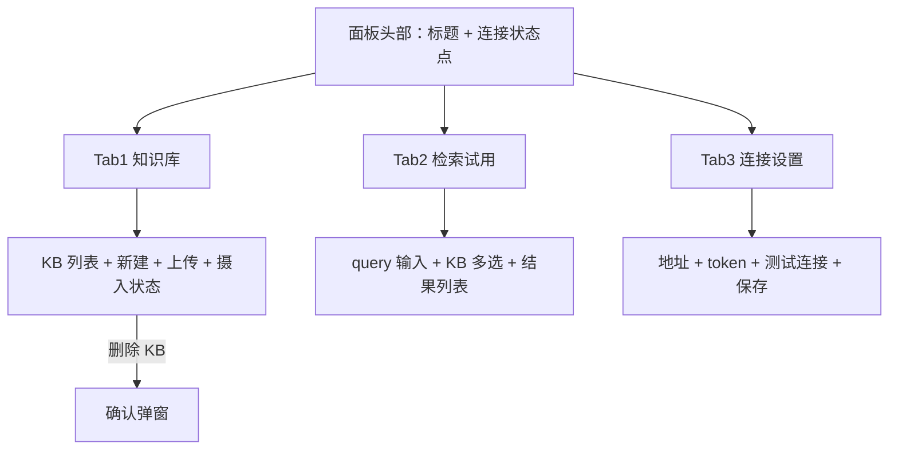

# 交互文档：ArkRAG 插件面板 v1.0

> 版本：v1.0 ｜ 日期：2026-10-04 ｜ 状态：已确认（用户指示"继续执行"）
> 适用范围：ArkRAG 服务端无 UI（纯 API）；本版唯一 UI = **ArkWork 插件面板**（kind='tool' 插件的 Client 半，iframe 沙箱内嵌 dock 面板）。Agent 检索工具（rag_search 等）为无 UI 交互，以"接口流"形式在 §6 描述。
> 交互设计参考：ArkWork Git Manager 插件范例（桥调用模式）、AnythingLLM 工作区知识库（列表+上传+状态）。

## 0. 设计 Token

**核心机制**：插件 iframe 无 same-origin，宿主经桥把白名单主题令牌注入 `:root`（契约见 ArkWork `src/shared/utils/plugin-theme-tokens.ts`，只增不改名）。**面板所有颜色/圆角一律 `var(--token, 回退值)` 引用**，随宿主深浅色自动切换；下列"取值"即回退值（与宿主现值一致）。

| Token | 浅色取值（回退） | 深色取值（回退） | 说明 |
|-------|------------------|------------------|------|
| `--bg-base` | `#FFFFFF` | `#1A1B1E` | 画布 |
| `--bg-surface` | `#F7F7F8` | `#202123` | 分区表面 |
| `--bg-surface-2` | `#F0F0F2` | `#26272B` | 卡片/输入框底 |
| `--bg-input` | `#FFFFFF` | `#26272B` | 输入框 |
| `--border-subtle / default / strong` | `rgba(0,0,0,.05/.10/.16)` | `rgba(255,255,255,.12)` 等 | 三级边框 |
| `--text-primary / secondary / tertiary / faint` | `#0F1115 / #57575C / #83838A / #90959C` | `#F1F3F5 / #B6B7BA / …` | 四级文字 |
| `--accent` | `#4F46E5` | `#679EFE` | 主操作色 |
| `--accent-soft` | `rgba(79,70,229,.14)` | `rgba(103,158,254,.14)` | 主色软底 |
| `--success / warning / danger` | `#16A34A / #D97706 / #DC2626` | `#34D399 / #FBBF24 / #F87171` | 语义色 |
| `--radius-sm / md / lg` | `6px / 10px / 14px` | 同 | 圆角档 |
| 字号 | 11 辅助 ｜ 12 次正文 ｜ 13 正文 ｜ 14 小节标题 ｜ 18 页面标题 | 同 | 桌面面板紧凑阶梯 |
| 间距 | 4 / 8 / 12 / 16 / 24 | 同 | 基准栅格 |
| 阴影 | 浮层 `0 8px 24px rgba(0,0,0,.12)` | 加深 | 仅 toast/弹窗 |
| 最小交互目标 | 按钮 ≥36px 高（桌面鼠标场景）；列表行高 ≥44px；图标按钮热区 ≥32px | 同 | 桌面适配说明：非触屏，主按钮保底 36px、行级热区保 44px |

- 禁止在面板里写死 hex（宿主令牌之外的中间色一律由上述 token 加 `opacity` 派生）。
- 状态色不做唯一区分：错误/成功均配图标+文字（红绿色盲兜底）。

## 1. 页面清单

| 编号 | 页面 | 入口 | 对应 PRD 功能 |
|------|------|------|----------------|
| P1 | 插件面板（单页，3 个 Tab：知识库 / 检索试用 / 连接设置） | ArkWork 插件安装并启用后，dock 面板 | F11-F14 |

## 2. 信息架构 / 页面跳转图

单页面板，无页面级跳转；Tab 平级切换，无导航栈。

## 3. 核心用户流程

**流程 1：首次配置（连接服务）**
1. 打开面板 → 若未配置服务地址，知识库/检索 Tab 内容区显示"未连接"引导卡（主按钮→跳设置 Tab）。
2. 设置 Tab 输入服务地址（默认 `http://127.0.0.1:8964`）与 API token → 点"测试连接"。
3. 成功：绿色 toast"连接成功 · ArkRAG vX.X"（顺带展示服务版本）+ 状态点变绿；失败：红色内联错误（区分超时/401/服务未启动，401 提示检查 token）。
4. 点"保存"→ 配置写入插件 storage（token 亦写入 ArkWork secrets.json 惯例位）→ 知识库 Tab 自动刷新。

**流程 2：建库并上传文档**
1. 知识库 Tab → 点"新建知识库"→ 内联表单（名称必填、描述选填）→ 提交后列表出现新 KB（选中态）。
2. 选中 KB → 点"上传文档"→ 文件选择器（多选，PDF/DOCX/PPTX/TXT/MD/HTML）→ 逐文件出"摄入状态行"：排队 → 解析中 → 向量化中 → 完成（✓ + chunk 数）或 失败（✗ + 原因 + 重试）。
3. 状态行完成后 KB 行文档数/chunk 数自动刷新。

**流程 3：检索试用**
1. 检索 Tab → KB 多选（默认全选）→ 输入问题（如"RAG 服务怎么配置 embedding 模型？"）→ 回车或点"检索"。
2. 结果列表：每条含分数徽标、来源（文档名 · 第 N 块）、chunk 文本（可展开）；顶部显示耗时与命中数。
3. 空结果：空态文案"没有命中内容，试试换一种问法"；服务错误：错误态 + 重试。

**流程 4：删除 KB（危险操作）**
1. KB 行"…"菜单 → 删除 → 确认弹窗（红色警示"将删除 N 个文档与全部向量，不可恢复"）→ 确认后列表移除 + toast。

## 4. 页面详述

### 页面 P1：插件面板

- **目的**：完成 ArkRAG 服务配置、知识库与文档管理、检索质量试用，全程不离开 ArkWork。
- **布局**：宽 320–480px 自适应（dock 面板），纵向滚动；头部 48px（标题+状态点）固定，Tab 栏 40px 固定，内容区滚动。
- **元素清单**：

| 元素 | 类型 | 说明 | 交互 |
|------|------|------|------|
| 标题"ArkRAG" | 文本 | 头部左侧 | — |
| 连接状态点 | 状态徽标 | 绿=已连接 / 灰=未配置 / 红=不可达 / 黄=token 无效 | hover 显示详情 tooltip |
| Tab 栏 | 分段控件 | 知识库 / 检索试用 / 连接设置 | 点击切换，选中态 accent 下划线 |
| 新建知识库按钮 | 次主按钮 | 知识库 Tab 顶部 | 展开内联表单 |
| KB 列表 | 卡片列表 | 名称、描述、文档数、chunk 数、相对时间 | 点击选中（选中态 accent 边）；"…"菜单：删除 |
| 上传文档按钮 | 主按钮 | 选中 KB 后可用 | 系统文件选择器，多选 |
| 摄入状态行 | 进度列表 | 文件名 + 阶段图标 + 文案；失败行带"重试" | 完成后 5s 淡出至"最近完成"分组 |
| 检索输入框 | 文本输入 + 检索按钮 | 检索 Tab 顶部 | Enter 触发 |
| KB 多选器 | 复选下拉 | 默认"全部" | — |
| 检索结果卡 | 列表 | 分数徽标（保留 3 位小数）、来源行、chunk 文本 3 行截断可展开 | 点击展开/收起 |
| 地址输入框 | 文本输入 | 设置 Tab，默认 `http://127.0.0.1:8964` | 失焦校验 URL 格式 |
| token 输入框 | 密码输入 | 带显隐切换 | — |
| 测试连接按钮 | 次主按钮 | 触发 `/api/v1/health` | loading 态 ≤10s 超时 |
| 保存按钮 | 主按钮 | 校验通过才可点 | 成功 toast |

- **页面五态（每个 Tab 内容区独立呈现）**：

| 状态 | 触发条件 | 界面表现 |
|------|----------|----------|
| 默认 | 已连接、有数据 | 正常内容 |
| 加载 | 请求中 | 内容区骨架屏（3 行灰色渐变块），≤10s 超时转错误 |
| 空 | 已连接但无 KB / 无文档 / 无检索结果 | 空态插图（线性图标）+ 一句话引导 + 主动作按钮（如"新建知识库"） |
| 错误 | 请求失败 / 未连接 / token 无效 | 错误图标 + 具体原因（未连接时给"去配置"按钮）+ 重试 |
| 成功 | 操作完成 | toast 2.5s（成功绿）或行内状态变更；不弹遮罩对话框 |

- **边界交互**：重复点击防抖（按钮 loading 期间禁用）；删除必须确认弹窗；上传中切换 Tab 状态行继续走（Host 半持有任务）；弱网/服务关闭时所有请求 10s 超时并转错误态；面板关闭重开恢复上次选中 Tab。

## 5. 全局交互规则

- **反馈规范**：轻反馈用 toast（2.5s，顶部滑入）；破坏性操作用确认弹窗；网络请求用按钮/行内 loading，不用全屏遮罩。
- **输入规则**：URL 失焦校验（http/https）；KB 名称非空 ≤64 字符，超限行内红字；token 校验只在"测试连接/保存"时发生。
- **文案规范**：错误消息三层——现象（"连接失败"）+ 原因（"服务未启动或地址错误"）+ 动作（"确认 arkrag-server 已启动后重试"）。
- **平台适配**：仅桌面端（Electron iframe），无移动断点；面板最小宽 320px 下不破版（列表元信息换行）。

## 6. 无 UI 交互流（Agent 工具，供系统设计对齐）

| 流 | 步骤 | 失败表现 |
|----|------|----------|
| Agent 检索 | 模型调 `plugin__arkrag.rag__rag_search(query, kb_ids?, top_k?)` → Host 半 net.fetch `POST /api/v1/search` → 结构化结果（数组 + 每条 kbId/docName/chunkIndex/分数/文本）→ 返回给模型 | 服务不可达 → isError + "启动 arkrag-server 后重试"；token 错 → isError + "检查插件面板连接设置" |
| 列知识库 | `plugin__arkrag.rag__rag_list_kbs()` → `GET /api/v1/kb` | 同上 |
| MCP 检索 | 外部 MCP 客户端 initialize → tools/list（rag_search/rag_list_kbs）→ tools/call | 同上（stdio 桥透传服务错误） |

## 变更记录

| 日期 | 原因 | 改动点 | 影响范围 |
|------|------|--------|----------|
| 2026-10-04 | 首版 | 全文 | — |

---

**门禁**：本文档经用户确认（用户指示"继续执行"）后，进入原型阶段。
